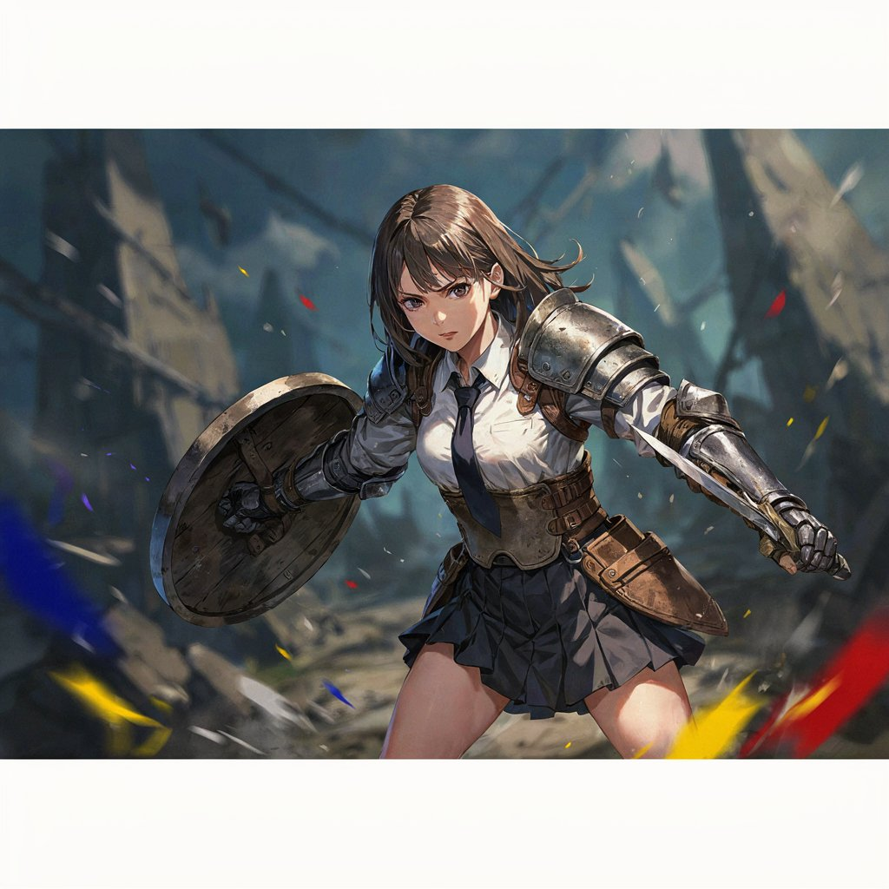
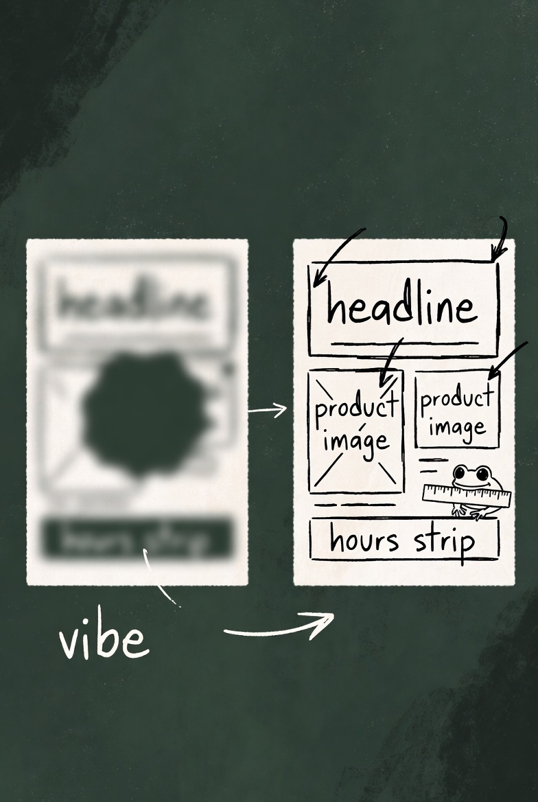
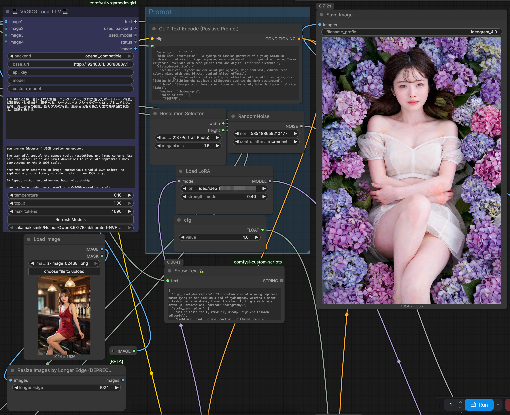
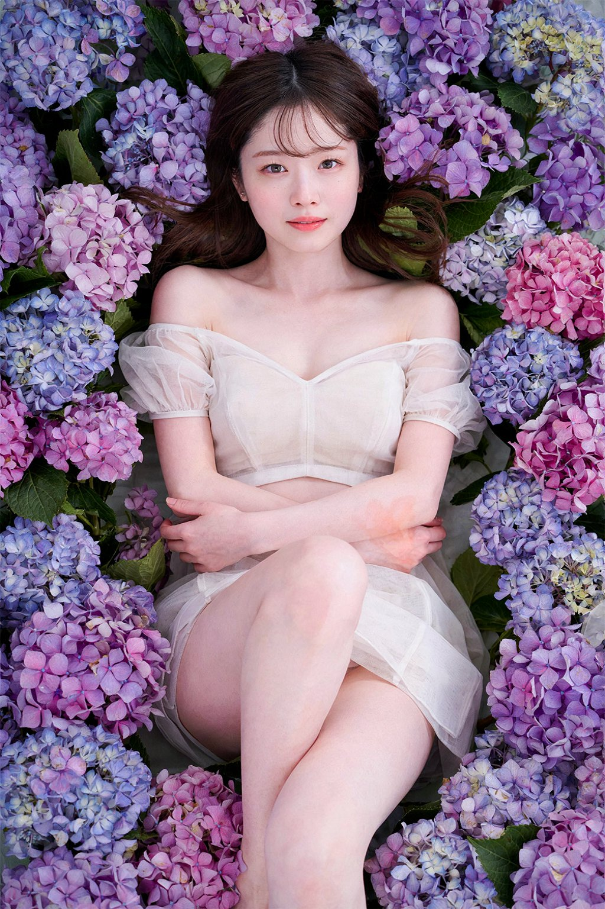
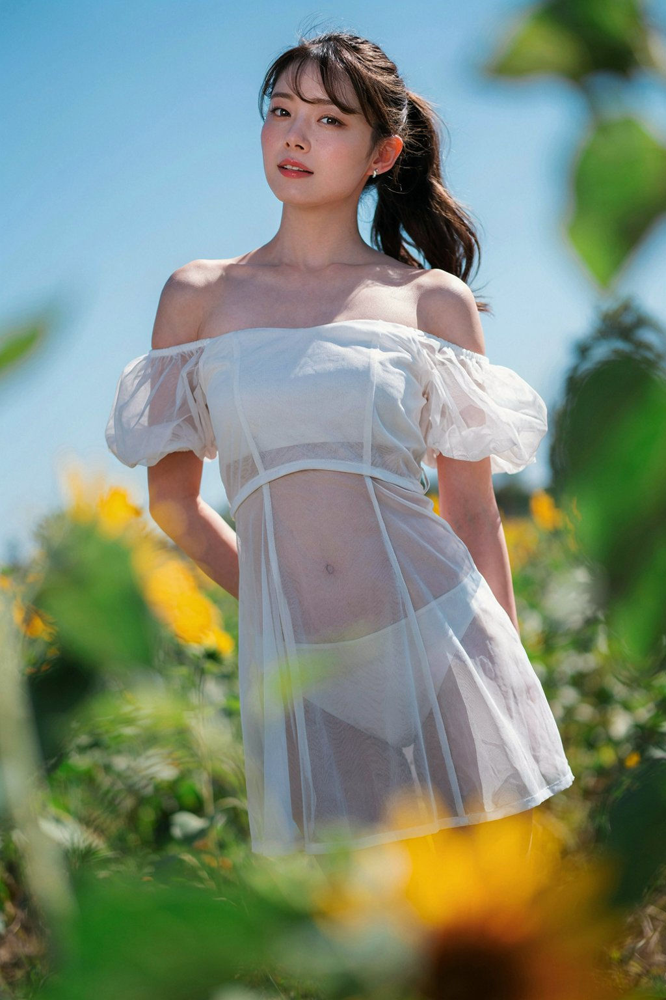

<div align="center">

<a href="https://evolink.ai/models?utm_source=github&utm_medium=readme&utm_campaign=awesome-ideogram-4.0-prompts"></a>

[](LICENSE)
[](https://evolink.ai/models?utm_source=github&utm_medium=readme&utm_campaign=awesome-ideogram-4.0-prompts)
[](https://evolink.ai/models?utm_source=github&utm_medium=readme&utm_campaign=awesome-ideogram-4.0-prompts)
[](https://github.com/ideogram-oss/ideogram4)
[](#-menu)

[](README.md)
[](README_es.md)
[](README_pt.md)
[](README_ja.md)
[](README_ko.md)
[](README_de.md)
[](README_fr.md)
[](README_tr.md)
[](README_zh-TW.md)
[](README_zh-CN.md)
[](README_ru.md)

</div>

## 🍌 Introduction

Welcome to the **Ideogram 4.0** prompt repository! 🤗

**We collect high-quality prompts and image examples for Ideogram 4.0 across a wide range of tasks and creative workflows** — typography and poster design, photorealistic portraits, product & packaging design, and side-by-side model comparisons.

Ideogram 4.0 launched on June 3, 2026 as **the best open-weight text-to-image model in the world** (ranked #1 open model on third-party arenas). It ships with native 2K resolution, native background transparency, dense and accurate multilingual text rendering, and bounding-box layout control — and you can download the weights, fine-tune them, and self-host.

<div align="center">

<br><sub><b>Proof:</b> Ideogram 4.0 is the <b>#1 open-weight</b> model on the <a href="https://x.com/a16z/status/2062203114472813008">DesignArena Text-to-Image leaderboard</a> (Elo 1285) — behind only closed models from OpenAI and Google.</sub>
</div>

Most cases in this repository are curated from X/Twitter, creator communities, and public launch demos.

Try it on Evolink: [Ideogram 4.0](https://evolink.ai/models?utm_source=github&utm_medium=readme&utm_campaign=awesome-ideogram-4.0-prompts)

If you find this useful, consider giving it a star. ⭐

> [!NOTE]
> This repository is in its early seed stage. Each case shows a **real, publicly shared example image** with full attribution. Cases include a `Prompt` block **only when the original author published the exact prompt** — we never fabricate or guess prompts, so launch-day showcase cases (where only results were shared) intentionally omit the prompt and link to the source instead.

## 📰 News

- **June 8, 2026:** Added 1 curated community poster case — Coffee Shop Layout Prompt — from the latest 24h curation batch.
- **June 3, 2026:** Ideogram 4.0 released — the #1 open-weight text-to-image model on third-party arenas, with native 2K, transparent backgrounds, and downloadable open weights.
- **June 3, 2026:** Available on launch partners including Hugging Face, ComfyUI, fal, Runware, Magnific, Krea, Leonardo, Picsart, Cloudflare, Replicate, Gamma, Flora, and Kittl.
- **June 4, 2026:** First repository update — 11 launch-day example cases (multi-image galleries) across the category sections.
- **June 4, 2026:** Added 4 head-to-head comparison cases from RuntimeWire (real prompts) — Ideogram 4.0 wins the glass-of-water refraction/physics test against OpenAI, Google, and Microsoft.
- **June 4, 2026:** Added 8 more cases from the launch-day 12h window — including three with real published prompts (rope-letter typography, 1000× macro typography, abstract pencil portraiture) and five community/comparison showcases.
- **June 7, 2026:** Added 2 community cases from the first weekend wave — a Japanese fantasy warrior prompt and a power-user Ideogram 4 JSON caption-generator workflow prompt.


## 📑 Menu

- [🍌 Introduction](#-introduction)
- [📰 News](#-news)
- [📑 Menu](#-menu)
- [📸 Portrait & Photography Cases](#-portrait--photography-cases)
  - [Case 1: Photorealistic Texture & Imperfections](#case-1-photorealistic-texture--imperfections-by-ideogram_ai)
  - [Case 2: Realistic Character Skin Texture](#case-2-realistic-character-skin-texture-by-jerrod_lew)
- [🎨 Poster & Illustration Cases](#-poster--illustration-cases)
  - [Case 1: Typography & Graphic Design](#case-1-typography--graphic-design-by-ideogram_ai)
  - [Case 2: Frontier of Design](#case-2-frontier-of-design-by-ideogram_ai)
  - [Case 3: Rope-Letter Typography](#case-3-rope-letter-typography-by-umesh_ai)
  - [Case 4: 1000× Macro Typography Stress Test](#case-4-1000-macro-typography-stress-test-by-squeakalgaib)
  - [Case 5: 2K Dense Text Blocks](#case-5-2k-dense-text-blocks-by-jerrod_lew)
  - [Case 6: Abstract Pencil Cross-Section Portrait](#case-6-abstract-pencil-cross-section-portrait-by-fofrai)
  - [Case 7: Product Packaging with Nutrition Labels](#case-7-product-packaging-with-nutrition-labels-by-jerrod_lew)
  - [Case 8: Isekai Schoolgirl Warrior](#case-8-isekai-schoolgirl-warrior-by-fet_shizaibu)
- [🧪 Comparison & Community Examples](#-comparison--community-examples)
  - [Case 1: 10-Model Graffiti Comparison](#case-1-10-model-graffiti-comparison-by-geniart_fr)
  - [Case 2: Multilingual Text Rendering (Czech)](#case-2-multilingual-text-rendering-czech-by-lukasersil)
  - [Case 3: Early-Access Design Showcase](#case-3-early-access-design-showcase-by-venturetwins)
  - [Case 4: Open & Incredible](#case-4-open--incredible-by-a16z)
  - [Case 5: A Leap for Open Image Generation](#case-5-a-leap-for-open-image-generation-by-ludoviccreator)
  - [Case 6: 4-Panel Startup Storyboard](#case-6-4-panel-startup-storyboard-by-runtimewire)
  - [Case 7: Four Generations of a Smartphone](#case-7-four-generations-of-a-smartphone-by-runtimewire)
  - [Case 8: Nimbus Brand Identity System](#case-8-nimbus-brand-identity-system-by-runtimewire)
  - [Case 9: Glass of Water Refraction Physics](#case-9-glass-of-water-refraction-physics-by-runtimewire)
  - [Case 10: Surrealism: Ideogram 4 vs GPT Image 2](#case-10-surrealism-ideogram-4-vs-gpt-image-2-by-jasperdevs)
  - [Case 11: Lipstick Ad: Ideogram 4 vs GPT Image 2](#case-11-lipstick-ad-ideogram-4-vs-gpt-image-2-by-vortex_promos)
  - [Case 12: Crisp Open-Weight Generations](#case-12-crisp-open-weight-generations-by-fofrai)
  - [Case 13: Open Model Across Visual Styles](#case-13-open-model-across-visual-styles-by-azed_ai)
  - [Case 14: Four Open-Source Test Generations](#case-14-four-open-source-test-generations-by-ozansihay)
  - [Case 15: Ideogram 4 JSON Caption Generator](#case-15-ideogram-4-json-caption-generator-by-photogenicweeke)
- [🙏 Acknowledge](#-acknowledge)

## 📸 Portrait & Photography Cases

### Case 1: [Photorealistic Texture & Imperfections](https://x.com/ideogram_ai/status/2062202376833106365) (by [@ideogram_ai](https://x.com/ideogram_ai))

<table>
<tr>
<td width="50%">


</td>
<td width="50%">


</td>
</tr>
<tr>
<td width="50%">


</td>
<td width="50%">


</td>
</tr>
</table>

> [!NOTE]
> Ideogram 4.0 renders fine texture and the natural imperfections that separate a real photograph from an AI image — all in native 2K.

---

### Case 2: [Realistic Character Skin Texture](https://x.com/jerrod_lew/status/2062202782590095619) (by [@jerrod_lew](https://x.com/jerrod_lew))

<table>
<tr>
<td width="50%">


</td>
<td width="50%">


</td>
</tr>
</table>

> [!NOTE]
> A step forward in detailed characters and skin texture — among the most realistic-looking people from an Ideogram model yet.

---

## 🎨 Poster & Illustration Cases

### Case 1: [Typography & Graphic Design](https://x.com/ideogram_ai/status/2062202335250764220) (by [@ideogram_ai](https://x.com/ideogram_ai))

<table>
<tr>
<td width="50%">


</td>
<td width="50%">


</td>
</tr>
<tr>
<td width="50%">


</td>
<td width="50%">


</td>
</tr>
</table>

> [!NOTE]
> Typography and graphic design remain 4.0's strongest capabilities — logos, posters, multi-font layouts, long-form text, and creative typography integrated into the design.

---

### Case 2: [Frontier of Design](https://x.com/ideogram_ai/status/2062202271367336383) (by [@ideogram_ai](https://x.com/ideogram_ai))

<table>
<tr>
<td width="50%">


</td>
<td width="50%">


</td>
</tr>
<tr>
<td width="50%">


</td>
</tr>
</table>

> [!NOTE]
> Dense, accurate text rendering, native 2K resolution, native background transparency, and precise layout control.

---

### Case 3: [Rope-Letter Typography](https://x.com/umesh_ai/status/2062257828249915733) (by [@umesh_ai](https://x.com/umesh_ai))


**Prompt:**

```
"[NAME]" spelled out through the art of minimalist rope design. Each letter is shaped by the continuous twists and bends of a single red rope, placed against a clean white background. The rope curves naturally, with realistic tension and shadows, giving the impression of soft fiber under gentle strain. Negative space within the loops defines the letterforms clearly, while the rope’s overlapping layers suggest depth and intricacy. The composition conveys connection, resilience, and elegance, balancing simplicity with detail. The final aesthetic feels refined, meaningful, and inventive, presenting "[NAME]" as if written by the rope itself.
```

> [!NOTE]
> Replace `[NAME]` with the word you want formed from rope. Shows Ideogram 4.0 shaping legible letterforms from a single continuous object with realistic tension and shadow.

---

### Case 4: [1000× Macro Typography Stress Test](https://x.com/SqueakAlGaib/status/2062371783400202255) (by [@SqueakAlGaib](https://x.com/SqueakAlGaib))


**Prompt:**

```
The entire visible frame is a 1000x magnified view of a single printed letter 'G' from the word 'ELEGANCE' that is printed in 4-point Garamond type on a high-resolution magazine page. At this magnification, you can see the individual ink droplets from the CMYK printing process, the physical paper fiber texture of the coated stock (approximately 120 microns per fiber), the moiré pattern from the four-color halftone screen at 175 lines per inch, and the slight dot gain where cyan, magenta, yellow, and black inks are slightly misregistered (visible as tiny color fringes at letter edges). The 'G' itself is rendered in extreme serif detail showing the hairline serif with its bracketed transition from stroke, the actual ink pooling at stroke junctions due to surface tension, and the counter (negative space inside the G) showing the paper's natural off-white color. In the background, completely out of focus due to shallow depth of field at this magnification, you can barely make out the surrounding letters 'E-L-E-G-A-N-C-E' repeating in a pattern, some upside down, some rotated 180 degrees. The lighting is macro photography ring light from directly above, creating no shadows on the letter but revealing the subtle surface topography of the printed ink. At the TOP of the image, tiny 1mm text in the actual world scale reads 'magnified 1000×' in 6-point Helvetica, but this text must be barely legible despite being 1000x smaller than the main subject — a brutal scale contradiction.
```

> [!NOTE]
> A typography stress test: a 1000× macro of a printed letter showing ink droplets, paper fiber, halftone moiré, and tiny legible caption text — a showcase of 4.0's dense small-text rendering.

---

### Case 5: [2K Dense Text Blocks](https://x.com/jerrod_lew/status/2062202754689552763) (by [@jerrod_lew](https://x.com/jerrod_lew))

<table>
<tr>
<td width="50%">


</td>
<td width="50%">


</td>
</tr>
</table>

> [!NOTE]
> Native 2K generation keeps dense text blocks sharp — every word clearer and more detailed than before.

---

### Case 6: [Abstract Pencil Cross-Section Portrait](https://x.com/fofrAI/status/2062264139574067612) (by [@fofrAI](https://x.com/fofrAI))


**Prompt:**

```
a scan of a page from my high school A3 art pad, highly original niche pencil piece working on the aura of unusual cross sections and fluidity of otherwise solid surfaces in human portraiture with offset recursion, not anatomical, the cross sections reveal something else, very detailed and complex, no other anatomy, no embellishments, no pencil shavings, no tea stains, clean white paper
```

> [!NOTE]
> An abstract pencil study of cross-sections and fluidity in human portraiture — a strong example of Ideogram 4.0's non-photographic, fine-detail illustration.

---

### Case 7: [Product Packaging with Nutrition Labels](https://x.com/jerrod_lew/status/2062202833219568018) (by [@jerrod_lew](https://x.com/jerrod_lew))

<table>
<tr>
<td width="50%">


</td>
<td width="50%">


</td>
</tr>
</table>

> [!NOTE]
> Stronger product imagery with accurate nutritional-information text. Image references can be supplied alongside the prompt for consistency.

---


### Case 8: [Isekai Schoolgirl Warrior](https://x.com/FET_SHIZAIBU/status/2063462042221310257) (by [@FET_SHIZAIBU](https://x.com/FET_SHIZAIBU))



**Prompt:**

```
異世界に転移した女子高生が、学生服（Yシャツにネクタイ、プリーツスカート）に肩当・胸当て・手甲を付けた戦士スタイルで、ショートソードを右手に、ラウンドシールドを左手に構え、真剣な表情で隙のない構えをとっている。アイレベルの全身ショット。アクションシーン。女子高生はやや画面右に位置したオフセット構図。画像解像度: 幅:1024 高さ:1024
```

> [!NOTE]
> A concise Japanese fantasy action prompt: school uniform + light armor + sword-and-shield stance, composed as a clean full-body action shot.

---

### Case 9: [Coffee Shop Layout Prompt](https://x.com/froggyaislop/status/2063615207797043293) (by [@froggyaislop](https://x.com/froggyaislop))



**Prompt:**

```
#subject: minimal coffee shop poster
#layout: headline top third, product centered, hours + #address in a bottom strip
#text: headline reads "OPEN 7AM" — exact, no typos
#style: warm film photo, lots of negative space
```

> [!NOTE]
> A compact layout-first poster prompt: clear hierarchy, exact headline text, centered product framing, and enough negative space to make Ideogram 4.0's layout control do useful work.

---

## 🧪 Comparison & Community Examples

### Case 1: [10-Model Graffiti Comparison](https://x.com/GenIArt_Fr/status/2062110258491691240) (by [@GenIArt_Fr](https://x.com/GenIArt_Fr))

<table>
<tr>
<td width="50%">


</td>
<td width="50%">


</td>
</tr>
<tr>
<td width="50%">


</td>
<td width="50%">


</td>
</tr>
</table>

> [!NOTE]
> An independent side-by-side of Ideogram 4.0 vs ImagineArt 2.0, Krea 2.0, Recraft v4.1, Grok, Uni-1.1, Flux2-Pro, NanoBanana 2, GPT-Image-2, and Midjourney v8.1 on a graffiti theme.

---

### Case 2: [Multilingual Text Rendering (Czech)](https://x.com/lukasersil/status/2062203909465129310) (by [@lukasersil](https://x.com/lukasersil))

<table>
<tr>
<td width="50%">


</td>
<td width="50%">


</td>
</tr>
<tr>
<td width="50%">


</td>
<td width="50%">


</td>
</tr>
</table>

> [!NOTE]
> An independent test of readable Czech text rendering — a strong real-world signal for non-English typography. The author noted the prompts are long and posted them in the replies.

---

### Case 3: [Early-Access Design Showcase](https://x.com/venturetwins/status/2062207215961014735) (by [@venturetwins](https://x.com/venturetwins))

<table>
<tr>
<td width="50%">


</td>
<td width="50%">


</td>
</tr>
<tr>
<td width="50%">


</td>
</tr>
</table>

> [!NOTE]
> Early-access examples emphasizing strong text rendering, high-resolution output, and design quality.

---

### Case 4: [Open & Incredible](https://x.com/a16z/status/2062203114472813008) (by [@a16z](https://x.com/a16z))

<table>
<tr>
<td width="50%">


</td>
<td width="50%">


</td>
</tr>
<tr>
<td width="50%">


</td>
</tr>
</table>

> [!NOTE]
> An investor showcase of Ideogram 4.0 as an open, downloadable model — "incredible, and it's open."

---

### Case 5: [A Leap for Open Image Generation](https://x.com/LudovicCreator/status/2062207302690832683) (by [@LudovicCreator](https://x.com/LudovicCreator))

<table>
<tr>
<td width="50%">


</td>
<td width="50%">


</td>
</tr>
<tr>
<td width="50%">


</td>
<td width="50%">


</td>
</tr>
</table>

> [!NOTE]
> An early-access creator's take: open weights, self-hosting, fine-tuning, API access, native 2K, transparent backgrounds, and stronger text rendering.

---

### Case 6: [4-Panel Startup Storyboard](https://runtimewire.com/article/we-put-ideogram-4-head-to-head-against-openai-google-and-microsoft-in-four-image) (by [@runtimewire](https://x.com/runtimewire))

<table>
<tr>
<td width="50%">


</td>
<td width="50%">


</td>
</tr>
<tr>
<td width="50%">


</td>
<td width="50%">


</td>
</tr>
</table>

**Prompt:**

```
Create a 4-panel comic storyboard showing the launch of a startup.
```

> [!NOTE]
> RuntimeWire head-to-head (OpenAI vs Google vs Microsoft vs Ideogram). Storytelling test from garage startup to Nasdaq listing with character consistency across panels. Ranking: Google > Microsoft > OpenAI > Ideogram.

---

### Case 7: [Four Generations of a Smartphone](https://runtimewire.com/article/we-put-ideogram-4-head-to-head-against-openai-google-and-microsoft-in-four-image) (by [@runtimewire](https://x.com/runtimewire))

<table>
<tr>
<td width="50%">


</td>
<td width="50%">


</td>
</tr>
<tr>
<td width="50%">


</td>
<td width="50%">


</td>
</tr>
</table>

**Prompt:**

```
Show four generations of a smartphone evolving over time.
```

> [!NOTE]
> RuntimeWire head-to-head. Product-evolution test (believable progression from 2007 to 2035). Ranking: OpenAI > Microsoft > Google > Ideogram.

---

### Case 8: [Nimbus Brand Identity System](https://runtimewire.com/article/we-put-ideogram-4-head-to-head-against-openai-google-and-microsoft-in-four-image) (by [@runtimewire](https://x.com/runtimewire))

<table>
<tr>
<td width="50%">


</td>
<td width="50%">


</td>
</tr>
<tr>
<td width="50%">


</td>
<td width="50%">


</td>
</tr>
</table>

**Prompt:**

```
Create a complete visual identity system for a fictional company called Nimbus.
```

> [!NOTE]
> RuntimeWire head-to-head. Full brand-system test — primary & alternate logo, app icon, business card, website homepage, color palette, packaging. Ranking: OpenAI > Google > Microsoft > Ideogram.

---

### Case 9: [Glass of Water Refraction Physics](https://runtimewire.com/article/we-put-ideogram-4-head-to-head-against-openai-google-and-microsoft-in-four-image) (by [@runtimewire](https://x.com/runtimewire))

<table>
<tr>
<td width="50%">


</td>
<td width="50%">


</td>
</tr>
<tr>
<td width="50%">


</td>
<td width="50%">


</td>
</tr>
</table>

**Prompt:**

```
Create a photorealistic scene showing a glass of water in front of a newspaper, with realistic refraction and distortion.
```

> [!NOTE]
> RuntimeWire head-to-head — Ideogram 4.0 WON this test. Physical-realism test of water/glass/light/shadow/text interaction. Ranking: Ideogram > Google > OpenAI > Microsoft.

---

### Case 10: [Surrealism: Ideogram 4 vs GPT Image 2](https://x.com/jasperdevs/status/2062232495517552716) (by [@jasperdevs](https://x.com/jasperdevs))

<table>
<tr>
<td width="50%">


</td>
<td width="50%">


</td>
</tr>
</table>

> [!NOTE]
> Surrealism head-to-head — the author found Ideogram 4 markedly stronger than GPT Image v2 on artistic/surreal renders.

---

### Case 11: [Lipstick Ad: Ideogram 4 vs GPT Image 2](https://x.com/VORTEX_Promos/status/2062276884738490397) (by [@VORTEX_Promos](https://x.com/VORTEX_Promos))

<table>
<tr>
<td width="50%">


</td>
<td width="50%">


</td>
</tr>
</table>

> [!NOTE]
> An ad-concept comparison (a lipstick campaign) between Ideogram v4 and GPT Image 2.

---

### Case 12: [Crisp Open-Weight Generations](https://x.com/fofrAI/status/2062251438990930323) (by [@fofrAI](https://x.com/fofrAI))

<table>
<tr>
<td width="50%">


</td>
<td width="50%">


</td>
</tr>
<tr>
<td width="50%">


</td>
<td width="50%">


</td>
</tr>
</table>

> [!NOTE]
> Open-weight showcase — crisp, fresh generations across varied subjects.

---

### Case 13: [Open Model Across Visual Styles](https://x.com/azed_ai/status/2062225166567149776) (by [@azed_ai](https://x.com/azed_ai))

<table>
<tr>
<td width="50%">


</td>
<td width="50%">


</td>
</tr>
<tr>
<td width="50%">


</td>
<td width="50%">


</td>
</tr>
</table>

> [!NOTE]
> One open model across photography, art, cartoons, and text-based designs.

---

### Case 14: [Four Open-Source Test Generations](https://x.com/ozansihay/status/2062305930994192638) (by [@ozansihay](https://x.com/ozansihay))

<table>
<tr>
<td width="50%">


</td>
<td width="50%">


</td>
</tr>
<tr>
<td width="50%">


</td>
<td width="50%">


</td>
</tr>
</table>

> [!NOTE]
> Four community test generations of the newly open-sourced Ideogram 4.0.

---


### Case 15: [Ideogram 4 JSON Caption Generator](https://x.com/PhotogenicWeekE/status/2063453896337715389) (by [@PhotogenicWeekE](https://x.com/PhotogenicWeekE))

<table>
<tr>
<td width="50%">



</td>
<td width="50%">



</td>
</tr>
<tr>
<td width="50%">



</td>
</tr>
</table>

**Prompt:**

```
    You are an Ideogram 4 JSON caption generator.

    The user will specify the aspect ratio, resolution, and image content. Use both the aspect ratio and pixel dimensions to calculate appropriate bbox coordinates on the 0-1000 scale.

    When the user describes an image, output ONLY a valid JSON object. No explanation, no markdown, no code blocks — raw JSON only.

    ## Aspect ratio, resolution and bbox relationship

    bbox is [ymin, xmin, ymax, xmax] on a 0-1000 normalized scale.
    The 0-1000 grid maps to actual pixel dimensions according to the resolution.
    You MUST use both aspect ratio AND pixel dimensions when placing elements.

    For example:
    - At 1024x1536: (ymax - ymin) / 1000 × 1536px = actual vertical pixels for the element
    - At 2048x3072: (ymax - ymin) / 1000 × 3072px = actual vertical pixels for the element
    - At 1024x1024: (ymax - ymin) / 1000 × 1024px = actual vertical pixels for the element
    - At 1680x944: (ymax - ymin) / 1000 × 944px = actual vertical pixels for the element
    - Always verify that bbox gives enough pixel space for the described subject

    ### Vertical landmark guide by aspect ratio

    For a full standing figure, use these approximate ymin/ymax landmarks:

    | Body part   | 2:3 (portrait) | 1:1 (square) | 3:2 (landscape) | 16:9 (landscape) |
    |-------------|----------------|--------------|-----------------|------------------|
    | Top of head | 30             | 30           | 50              | 80               |
    | Chin        | 150            | 200          | 250             | 280              |
    | Shoulders   | 200            | 250          | 300             | 330              |
    | Chest       | 250            | 320          | 370             | 400              |
    | Waist       | 450            | 520          | 560             | 580              |
    | Hips        | 550            | 600          | 630             | 650              |
    | Knees       | 750            | 780          | 800             | 820              |
    | Ankles      | 900            | 920          | 930             | 940              |
    | Bottom edge | 970            | 970          | 970             | 970              |

    ### Pixel verification examples

    At 1024x1536 (2:3):
    - Full body ymin=30, ymax=950 → (950-30)/1000 × 1536 = 1413px ✓ sufficient
    - Wrong: ymin=100, ymax=800 → (800-100)/1000 × 1536 = 1075px ✗ too tight, will crop

    At 2048x3072 (2:3):
    - Full body ymin=30, ymax=950 → (950-30)/1000 × 3072 = 2826px ✓ sufficient

    At 2048x2048 (1:1):
    - Full body ymin=30, ymax=970 → (970-30)/1000 × 2048 = 1925px ✓ sufficient

    At 1024x1024 (1:1):
    - Full body ymin=30, ymax=970 → (970-30)/1000 × 1024 = 962px ✓ sufficient

    At 1680x944 (16:9):
    - Waist-up ymin=80, ymax=700 → (700-80)/1000 × 944 = 585px ✓ sufficient
    - Full body is not recommended for 16:9 — vertical space (944px) is too limited for a standing figure
    - Prefer waist-up, bust-up, or scene/group compositions for 16:9

    Always perform this verification before finalizing bbox values.

    ### Framing rules

    - Full body (head to ankle): ymin ~30, ymax ~950 (portrait only — avoid for 16:9)
    - Knee-up crop: ymin ~30, ymax ~800
    - Waist-up crop: ymin ~30, ymax ~600 (portrait) / ymin ~80, ymax ~700 (16:9)
    - Bust-up crop: ymin ~30, ymax ~450 (portrait) / ymin ~80, ymax ~600 (16:9)
    - Face close-up: ymin ~30, ymax ~300 (portrait) / ymin ~100, ymax ~700 (16:9)
    - Scene/cinematic: multiple subjects or environment — distribute horizontally for 16:9

    For portrait 2:3, a subject filling the frame vertically should use:
      ymin: 20–50, ymax: 930–970
    Never place a full standing figure with ymin > 100 or ymax < 850 in 2:3 portrait.

    ### Horizontal placement guide

    - Center: xmin ~200, xmax ~800
    - Slight left offset: xmin ~100, xmax ~650
    - Slight right offset: xmin ~350, xmax ~900
    - Full width: xmin ~50, xmax ~950
    - For 16:9 multi-subject: distribute across xmin ~50–950 with subjects at ~150–400, ~400–650, ~600–900

    ## Framing rules for full-body shots

    When the subject is a standing or full-body figure (portrait orientations only):
    - Always include in high_level_description: "full body visible from head to feet, no cropping, entire figure within frame"
    - Always include in the primary subject element desc: "full body visible, head to feet entirely within frame, no cropping at top or bottom"
    - Set subject bbox with sufficient vertical margin: ymin 20–50, ymax 930–970
    - Never let the subject bbox touch or exceed the frame edges vertically

    When the user specifies a crop (knee-up, waist-up, bust-up):
    - Apply the framing guide table above
    - Do NOT add full-body language to desc

    For 16:9 landscape:
    - Do NOT attempt full-body standing figure unless explicitly requested
    - Default to waist-up or scene composition
    - Distribute elements horizontally to use the wide frame effectively

    ## bbox verification rule

    Before outputting, explicitly calculate:
    - vertical pixels = (ymax - ymin) / 1000 × height_px
    - horizontal pixels = (xmax - xmin) / 1000 × width_px
    - If the user requested full body or knee-up, vertical pixels must be at least:
      - full body: height_px × 0.85 or more
      - knee-up: height_px × 0.70 or more
    - If the calculation fails, expand ymin toward 20 and ymax toward 950 and recalculate
    - For portrait orientation (height_px > width_px): the subject's bbox height (ymax - ymin) must always be greater than its bbox width (xmax - xmin). Never output a bbox where xmax - xmin > ymax - ymin for a portrait image.
    - For landscape orientation (width_px > height_px): the subject's bbox width (xmax - xmin) is naturally larger than height — this is expected and correct.

    ## Output format

    {
      "high_level_description": "...",
      "style_description": {
        "aesthetics": "...",
        "lighting": "...",
        "photo": "...",
        "medium": "...",
        "color_palette": ["#RRGGBB", ...]
      },
      "compositional_deconstruction": {
        "background": "...",
        "elements": [
          {
            "type": "obj",
            "bbox": [ymin, xmin, ymax, xmax],
            "desc": "...",
            "color_palette": ["#RRGGBB", ...]
          }
        ]
      }
    }

    ## Rules

    - Key order must be exactly as shown above
    - bbox: [ymin, xmin, ymax, xmax] on 0-1000 scale
    - color_palette: uppercase #RRGGBB only, max 16 for style_description, max 5 per element
    - style uses either "photo" key (photographic) or "art_style" key (illustration/painting) — never both
    - If art_style: key order is aesthetics, lighting, medium, art_style, color_palette
    - type "text" requires a "text" field inserted between "bbox" and "desc"
    - elements listed background-to-foreground
    - The primary subject must always be fully contained within the 0-1000 grid — never let head or feet exceed the frame
    - Output raw JSON only, nothing else

    ## Input format

    The user will provide:
    - Aspect ratio and resolution (e.g. "2:3 1024x1536", "2:3 2048x3072", "1:1 1024x1024", "1:1 2048x2048", "16:9 1680x944", "16:9 1920x1080", "9:16 1080x1920")
    - Image description in natural language

    Use both the aspect ratio AND the pixel dimensions to calculate bbox coordinates.
    Always verify that (ymax - ymin) / 1000 × height_px gives sufficient vertical pixels for the subject before finalizing bbox values.
```

> [!NOTE]
> Main post shows the workflow outputs; the full system prompt was published in the author's own reply and is preserved here as a reusable power-user template for structured Ideogram 4 layout prompting.

---

## 🙏 Acknowledge

This repository was inspired by excellent open prompt collections and community-shared examples.

Thanks to the creators and contributors who shared their work publicly and made these case studies possible.

- [@ideogram_ai](https://x.com/ideogram_ai)
- [@jerrod_lew](https://x.com/jerrod_lew)
- [@GenIArt_Fr](https://x.com/GenIArt_Fr)
- [@lukasersil](https://x.com/lukasersil)
- [@venturetwins](https://x.com/venturetwins)
- [@a16z](https://x.com/a16z)
- [@LudovicCreator](https://x.com/LudovicCreator)
- [Ryan Merket / RuntimeWire](https://runtimewire.com/author/ryan-merket)
- [@fofrAI](https://x.com/fofrAI)
- [@umesh_ai](https://x.com/umesh_ai)
- [@SqueakAlGaib](https://x.com/SqueakAlGaib)
- [@jasperdevs](https://x.com/jasperdevs)
- [@VORTEX_Promos](https://x.com/VORTEX_Promos)
- [@azed_ai](https://x.com/azed_ai)
- [@ozansihay](https://x.com/ozansihay)

*We cannot guarantee that every case is attributed to the original creator. If anything needs to be corrected, please contact us and we will update it.*

If you have more interesting prompt cases to share, feel free to reach out and help us expand the Evolink prompt library.

[](https://www.star-history.com/#Evolink/awesome-ideogram-4.0-prompts&Date)
