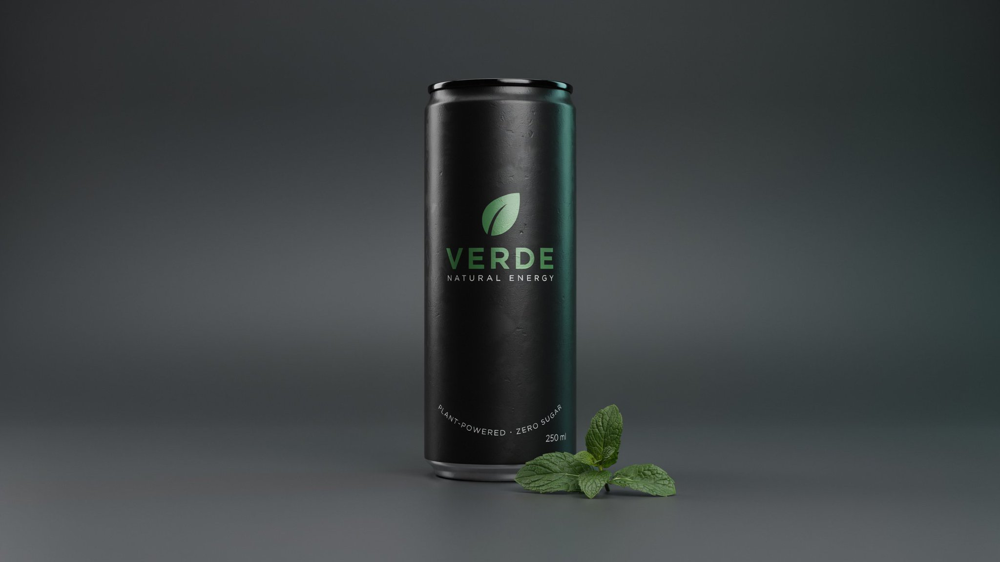
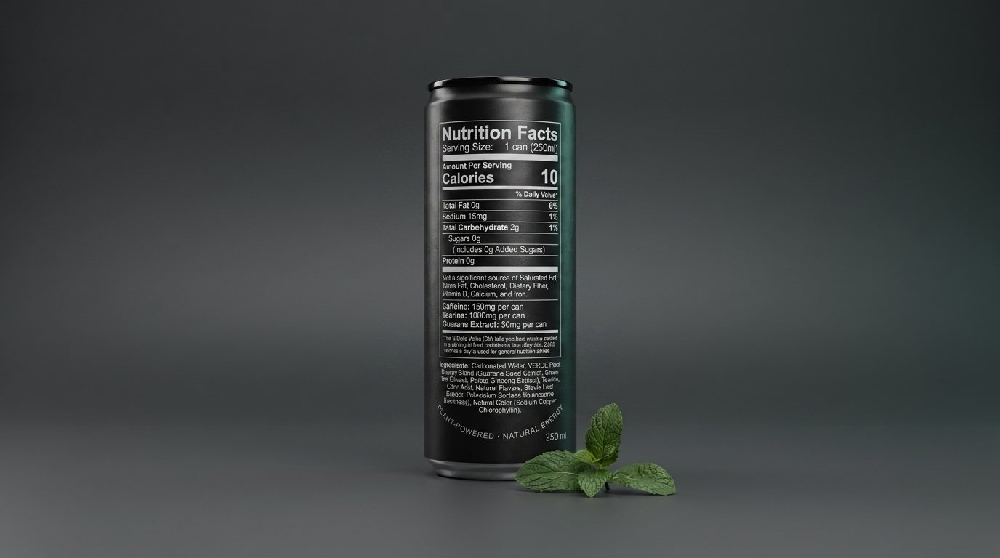
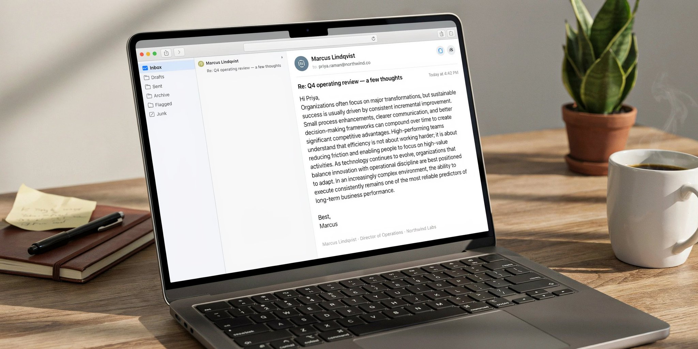
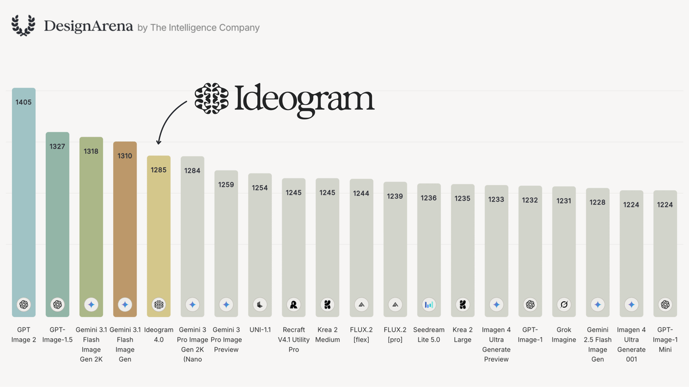

<div align="center">


[](LICENSE)
[](https://evolink.ai)
[](https://ideogram.ai/models/4.0)
[](https://github.com/ideogram-oss/ideogram4)
[](#-menu)

[](README.md)
[](README_es.md)
[](README_pt.md)
[](README_ja.md)
[](README_ko.md)
[](README_de.md)
[](README_fr.md)
[](README_tr.md)
[](README_zh-TW.md)
[](README_zh-CN.md)
[](README_ru.md)

</div>

## 🍌 Introduction

Welcome to the **Ideogram 4.0** prompt repository! 🤗

**We collect high-quality prompts and image examples for Ideogram 4.0 across a wide range of tasks and creative workflows** — typography and poster design, photorealistic portraits, product and UI mockups, and side-by-side model comparisons.

Ideogram 4.0 launched on June 3, 2026 as **the best open-weight text-to-image model in the world** (ranked #1 open model on third-party arenas). It ships with native 2K resolution, native background transparency, dense and accurate multilingual text rendering, and bounding-box layout control — and you can download the weights, fine-tune them, and self-host.

Most cases in this repository are curated from X/Twitter, creator communities, and public launch demos.

Try it on Evolink: [Ideogram 4.0](https://ideogram.ai/models/4.0)

If you find this useful, consider giving it a star. ⭐

> [!NOTE]
> This repository is in its early seed stage. Each case shows a **real, publicly shared example image** with full attribution. Cases include a `Prompt` block **only when the original author published the exact prompt** — we never fabricate or guess prompts, so launch-day showcase cases (where only results were shared) intentionally omit the prompt and link to the source instead.

<a href='https://ideogram.ai/models/4.0'></a>
<a href='https://evolink.ai'></a>
<a href='https://github.com/ideogram-oss/ideogram4'></a>

## 📰 News

- **June 3, 2026:** Ideogram 4.0 released — the #1 open-weight text-to-image model on third-party arenas, with native 2K, transparent backgrounds, and downloadable open weights.
- **June 3, 2026:** Available on launch partners including Hugging Face, ComfyUI, fal, Runware, Magnific, Krea, Leonardo, Picsart, Cloudflare, Replicate, Gamma, Flora, and Kittl.
- **June 4, 2026:** First repository update — 11 launch-day example cases (multi-image galleries) across 4 categories.
- **June 4, 2026:** Added 4 head-to-head comparison cases from RuntimeWire (real prompts) — Ideogram 4.0 wins the glass-of-water refraction/physics test against OpenAI, Google, and Microsoft.

## 📑 Menu

- [🍌 Introduction](#-introduction)
- [📰 News](#-news)
- [📑 Menu](#-menu)
- [📸 Portrait & Photography Cases](#-portrait--photography-cases)
  - [Case 1: Photorealistic Texture & Imperfections](#case-1-photorealistic-texture--imperfections-by-ideogram_ai)
  - [Case 2: Realistic Character Skin Texture](#case-2-realistic-character-skin-texture-by-jerrod_lew)
- [🎨 Poster & Illustration Cases](#-poster--illustration-cases)
  - [Case 1: Typography & Graphic Design](#case-1-typography--graphic-design-by-ideogram_ai)
  - [Case 2: Frontier of Design](#case-2-frontier-of-design-by-ideogram_ai)
- [🖼️ UI & Social Media Mockup Cases](#️-ui--social-media-mockup-cases)
  - [Case 1: Product Packaging with Nutrition Labels](#case-1-product-packaging-with-nutrition-labels-by-jerrod_lew)
  - [Case 2: 2K Dense Text Blocks](#case-2-2k-dense-text-blocks-by-jerrod_lew)
- [🧪 Comparison & Community Examples](#-comparison--community-examples)
  - [Case 1: 10-Model Graffiti Comparison](#case-1-10-model-graffiti-comparison-by-geniart_fr)
  - [Case 2: Multilingual Text Rendering (Czech)](#case-2-multilingual-text-rendering-czech-by-lukasersil)
  - [Case 3: Early-Access Design Showcase](#case-3-early-access-design-showcase-by-venturetwins)
  - [Case 4: Open & Incredible](#case-4-open--incredible-by-a16z)
  - [Case 5: A Leap for Open Image Generation](#case-5-a-leap-for-open-image-generation-by-ludoviccreator)
  - [Case 6: 4-Panel Startup Storyboard](#case-6-4-panel-startup-storyboard-by-runtimewire)
  - [Case 7: Four Generations of a Smartphone](#case-7-four-generations-of-a-smartphone-by-runtimewire)
  - [Case 8: Nimbus Brand Identity System](#case-8-nimbus-brand-identity-system-by-runtimewire)
  - [Case 9: Glass of Water Refraction Physics](#case-9-glass-of-water-refraction-physics-by-runtimewire)
- [🙏 Acknowledge](#-acknowledge)

## 📸 Portrait & Photography Cases

### Case 1: [Photorealistic Texture & Imperfections](https://x.com/ideogram_ai/status/2062202376833106365) (by [@ideogram_ai](https://x.com/ideogram_ai))

<table>
<tr>
<td width="50%">


</td>
<td width="50%">


</td>
</tr>
<tr>
<td width="50%">


</td>
<td width="50%">


</td>
</tr>
</table>

> [!NOTE]
> Ideogram 4.0 renders fine texture and the natural imperfections that separate a real photograph from an AI image — all in native 2K.

---

### Case 2: [Realistic Character Skin Texture](https://x.com/jerrod_lew/status/2062202782590095619) (by [@jerrod_lew](https://x.com/jerrod_lew))

<table>
<tr>
<td width="50%">


</td>
<td width="50%">


</td>
</tr>
</table>

> [!NOTE]
> A step forward in detailed characters and skin texture — among the most realistic-looking people from an Ideogram model yet.

---

## 🎨 Poster & Illustration Cases

### Case 1: [Typography & Graphic Design](https://x.com/ideogram_ai/status/2062202335250764220) (by [@ideogram_ai](https://x.com/ideogram_ai))

<table>
<tr>
<td width="50%">


</td>
<td width="50%">


</td>
</tr>
<tr>
<td width="50%">


</td>
<td width="50%">


</td>
</tr>
</table>

> [!NOTE]
> Typography and graphic design remain 4.0's strongest capabilities — logos, posters, multi-font layouts, long-form text, and creative typography integrated into the design.

---

### Case 2: [Frontier of Design](https://x.com/ideogram_ai/status/2062202271367336383) (by [@ideogram_ai](https://x.com/ideogram_ai))

<table>
<tr>
<td width="50%">


</td>
<td width="50%">


</td>
</tr>
<tr>
<td width="50%">


</td>
</tr>
</table>

> [!NOTE]
> Dense, accurate text rendering, native 2K resolution, native background transparency, and precise layout control.

---

## 🖼️ UI & Social Media Mockup Cases

### Case 1: [Product Packaging with Nutrition Labels](https://x.com/jerrod_lew/status/2062202833219568018) (by [@jerrod_lew](https://x.com/jerrod_lew))

<table>
<tr>
<td width="50%">



</td>
<td width="50%">



</td>
</tr>
</table>

> [!NOTE]
> Stronger product imagery with accurate nutritional-information text. Image references can be supplied alongside the prompt for consistency.

---

### Case 2: [2K Dense Text Blocks](https://x.com/jerrod_lew/status/2062202754689552763) (by [@jerrod_lew](https://x.com/jerrod_lew))

<table>
<tr>
<td width="50%">


</td>
<td width="50%">



</td>
</tr>
</table>

> [!NOTE]
> Native 2K generation keeps dense text blocks sharp — every word clearer and more detailed than before.

---

## 🧪 Comparison & Community Examples

### Case 1: [10-Model Graffiti Comparison](https://x.com/GenIArt_Fr/status/2062110258491691240) (by [@GenIArt_Fr](https://x.com/GenIArt_Fr))

<table>
<tr>
<td width="50%">


</td>
<td width="50%">


</td>
</tr>
<tr>
<td width="50%">


</td>
<td width="50%">


</td>
</tr>
</table>

> [!NOTE]
> An independent side-by-side of Ideogram 4.0 vs ImagineArt 2.0, Krea 2.0, Recraft v4.1, Grok, Uni-1.1, Flux2-Pro, NanoBanana 2, GPT-Image-2, and Midjourney v8.1 on a graffiti theme.

---

### Case 2: [Multilingual Text Rendering (Czech)](https://x.com/lukasersil/status/2062203909465129310) (by [@lukasersil](https://x.com/lukasersil))

<table>
<tr>
<td width="50%">


</td>
<td width="50%">


</td>
</tr>
<tr>
<td width="50%">


</td>
<td width="50%">


</td>
</tr>
</table>

> [!NOTE]
> An independent test of readable Czech text rendering — a strong real-world signal for non-English typography. The author noted the prompts are long and posted them in the replies.

---

### Case 3: [Early-Access Design Showcase](https://x.com/venturetwins/status/2062207215961014735) (by [@venturetwins](https://x.com/venturetwins))

<table>
<tr>
<td width="50%">


</td>
<td width="50%">


</td>
</tr>
<tr>
<td width="50%">


</td>
</tr>
</table>

> [!NOTE]
> Early-access examples emphasizing strong text rendering, high-resolution output, and design quality.

---

### Case 4: [Open & Incredible](https://x.com/a16z/status/2062203114472813008) (by [@a16z](https://x.com/a16z))

<table>
<tr>
<td width="50%">


</td>
<td width="50%">


</td>
</tr>
<tr>
<td width="50%">


</td>
<td width="50%">



</td>
</tr>
</table>

> [!NOTE]
> An investor showcase of Ideogram 4.0 as an open, downloadable model — "incredible, and it's open."

---

### Case 5: [A Leap for Open Image Generation](https://x.com/LudovicCreator/status/2062207302690832683) (by [@LudovicCreator](https://x.com/LudovicCreator))

<table>
<tr>
<td width="50%">


</td>
<td width="50%">


</td>
</tr>
<tr>
<td width="50%">


</td>
<td width="50%">


</td>
</tr>
</table>

> [!NOTE]
> An early-access creator's take: open weights, self-hosting, fine-tuning, API access, native 2K, transparent backgrounds, and stronger text rendering.

---

### Case 6: [4-Panel Startup Storyboard](https://runtimewire.com/article/we-put-ideogram-4-head-to-head-against-openai-google-and-microsoft-in-four-image) (by [@runtimewire](https://x.com/runtimewire))

<table>
<tr>
<td width="50%">


</td>
<td width="50%">


</td>
</tr>
<tr>
<td width="50%">


</td>
<td width="50%">


</td>
</tr>
</table>

**Prompt:**

```
Create a 4-panel comic storyboard showing the launch of a startup.
```

> [!NOTE]
> RuntimeWire head-to-head (OpenAI vs Google vs Microsoft vs Ideogram). Storytelling test from garage startup to Nasdaq listing with character consistency across panels. Ranking: Google > Microsoft > OpenAI > Ideogram.

---

### Case 7: [Four Generations of a Smartphone](https://runtimewire.com/article/we-put-ideogram-4-head-to-head-against-openai-google-and-microsoft-in-four-image) (by [@runtimewire](https://x.com/runtimewire))

<table>
<tr>
<td width="50%">


</td>
<td width="50%">


</td>
</tr>
<tr>
<td width="50%">


</td>
<td width="50%">


</td>
</tr>
</table>

**Prompt:**

```
Show four generations of a smartphone evolving over time.
```

> [!NOTE]
> RuntimeWire head-to-head. Product-evolution test (believable progression from 2007 to 2035). Ranking: OpenAI > Microsoft > Google > Ideogram.

---

### Case 8: [Nimbus Brand Identity System](https://runtimewire.com/article/we-put-ideogram-4-head-to-head-against-openai-google-and-microsoft-in-four-image) (by [@runtimewire](https://x.com/runtimewire))


**Prompt:**

```
Create a complete visual identity system for a fictional company called Nimbus.
```

> [!NOTE]
> RuntimeWire head-to-head. Full brand-system test — primary & alternate logo, app icon, business card, website homepage, color palette, packaging. Ranking: OpenAI > Google > Microsoft > Ideogram.

---

### Case 9: [Glass of Water Refraction Physics](https://runtimewire.com/article/we-put-ideogram-4-head-to-head-against-openai-google-and-microsoft-in-four-image) (by [@runtimewire](https://x.com/runtimewire))

<table>
<tr>
<td width="50%">


</td>
<td width="50%">


</td>
</tr>
<tr>
<td width="50%">


</td>
<td width="50%">


</td>
</tr>
</table>

**Prompt:**

```
Create a photorealistic scene showing a glass of water in front of a newspaper, with realistic refraction and distortion.
```

> [!NOTE]
> RuntimeWire head-to-head — Ideogram 4.0 WON this test. Physical-realism test of water/glass/light/shadow/text interaction. Ranking: Ideogram > Google > OpenAI > Microsoft.

---
## 🙏 Acknowledge

This repository was inspired by excellent open prompt collections and community-shared examples.

Thanks to the creators and contributors who shared their work publicly and made these case studies possible.

- [@ideogram_ai](https://x.com/ideogram_ai)
- [@jerrod_lew](https://x.com/jerrod_lew)
- [@GenIArt_Fr](https://x.com/GenIArt_Fr)
- [@lukasersil](https://x.com/lukasersil)
- [@venturetwins](https://x.com/venturetwins)
- [@a16z](https://x.com/a16z)
- [@LudovicCreator](https://x.com/LudovicCreator)
- [Ryan Merket / RuntimeWire](https://runtimewire.com/author/ryan-merket)

*We cannot guarantee that every case is attributed to the original creator. If anything needs to be corrected, please contact us and we will update it.*

If you have more interesting prompt cases to share, feel free to reach out and help us expand the Evolink prompt library.

[](https://www.star-history.com/#Evolink/awesome-ideogram-4.0-prompts&Date)
